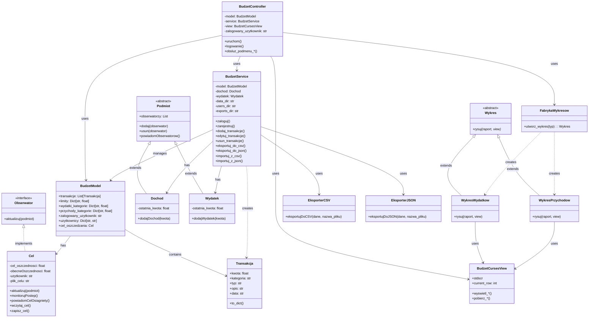

## Budget Manager - Dokumentacja oraz instrukcja obsługi


### Autorzy:
- Łukasz Kotowski
- Jakub Kazimiruk
- Norbert Kopeć
- Bartłomiej Karanowski

Studia dzienne  
Kierunek: Informatyka  
Semestr: V  
Grupa zajęciowa: PS3

Data wykonania ćwiczenia:  
Listopad -- grudzień 2024 r.  
Styczeń 2025 r.

## Spis treści
- [Diagram klas budujących](#diagram-klas-budujących)
- [Opisy wzorców](#opisy-wzorców)
  - [Wzorzec MVC (Model-View-Controller)](#wzorzec-mvc-model-view-controller)
  - [Wzorzec Obserwator (Observer)](#wzorzec-obserwator-observer)
  - [Wzorzec Adapter](#wzorzec-adapter)
- [Opisy rozwiązań](#opisy-rozwiązań)
- [Podział pracy](#podział-pracy)
- [Instrukcja użytkownika](#instrukcja-użytkownika)
- [Instrukcja instalacji](#instrukcja-instalacji)

## Diagram klas budujących


## Opisy wzorców

### Wzorzec MVC (Model-View-Controller)

**Cel użycia:**
- Umożliwienie niezależnego rozwoju i testowania komponentów
- Separacja logiki biznesowej od prezentacji danych
- Ułatwienie utrzymania i modyfikacji kodu poprzez jasny podział odpowiedzialności

**Przyporządkowanie klas:**
- Model (BudzetModel)
- View (BudzetCursesView)
- Controller

**Interakcje między komponentami:**
1. **Przepływ danych:**
   - Controller pobiera dane od View
   - Controller aktualizuje Model poprzez Service
   - View wyświetla dane z Modelu otrzymane przez Controller

2. **Separacja odpowiedzialności:**
   - Model: przechowywanie danych i stan aplikacji
   - View: interfejs użytkownika i prezentacja danych
   - Controller: logika aplikacji i koordynacja

### Wzorzec Obserwator (Observer)

**Cel użycia:**
- Elastyczne dodawanie nowych reakcji na zmiany
- Automatyczne powiadamianie o zmianach w stanie aplikacji
- Luźne powiązanie między komponentami systemu

### Wzorzec Adapter

**Cel użycia:**  
Wzorzec Adapter został wykorzystany do ujednolicenia interfejsu eksportu danych dla różnych formatów (CSV, JSON). Umożliwia on łatwe dodawanie kolejnych formatów eksportu, spójną komunikację między modelem i różnymi formatami zapisu danych.

**Przyporządkowanie klas:**
- Target (Cel) - UniwersalnyInterfejsEksportu
- Adapter - AdapterEksportu, AdapterEksportuCSV, AdapterEksportuJSON
- Adaptee (Adaptowany) - EksporterCSV, EksporterJSON
- Client (Klient) - EksportDanych

## Opisy rozwiązań

**Język programowania:** Python

**Biblioteki standardowe:**
- **json**: Serializacja i deserializacja danych w formacie JSON
- **os**: Operacje na systemie plików
- **datetime**: Obsługa dat i czasu
- **csv**: Import i eksport danych w formacie CSV
- **logging**: Tworzenie logów aplikacji

**Biblioteki zewnętrzne:**
- **curses**: Tworzenie interfejsu tekstowego (TUI)

**Specyficzne rozwiązania Pythona:**
- Dekoratory (@dataclass)
- Type hinting
- List comprehensions
- Słowniki
- Context managers

## Podział pracy

### Łukasz Kotowski
- Wzorzec MVC
- Wzorzec Observator
- Diagramy UML
- Interfejs tekstowy windows-curses
- Interfejs graficzny custom-tkinter
- Dokumentacja

### Jakub Kazimiruk
- Wzorzec Adapter
- Dokumentacja
- Interfejs tekstowy windows-curses (Importowanie i eksportowanie)

### Norbert Kopeć
- Wzorzec Fabryka

### Bartłomiej Karanowski
- Wzorzec Budowniczy
- Dokumentacja

## Instrukcja instalacji

### Wymagania
- Python
- Custom Tkinter (do obsługi interfejsu graficznego)
- Curses (do obsługi interfejsu tekstowego)
- Matplotlib

### Instalacja komponentów
```bash
pip install customtkinter
pip install windows-curses
pip install matplotlib
```

### Uruchomienie aplikacji
1. Przejdź do folderu programu
2. Uruchom program komendą:
```bash
python main.py
```
